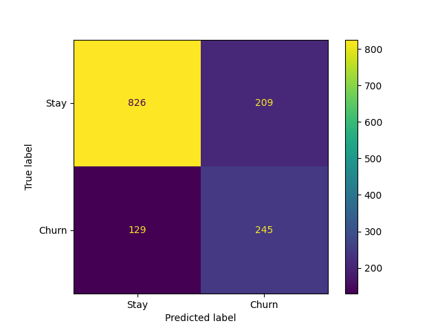
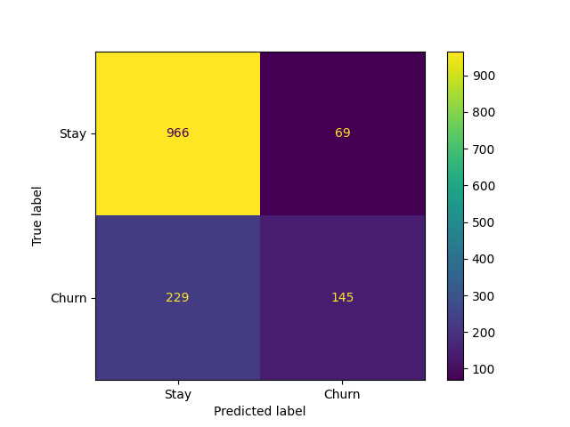
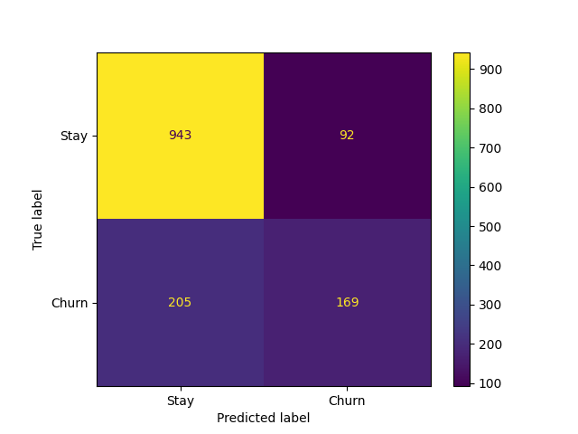

# Customer Churn Prediction

Predict whether a telecom customer will churn using machine learning.

---

## Dataset

Kaggle Telco Customer Churn  
7,043 customers  
21 features  

---

## Model Evaluation

| Metric | Score |
|--------|------|
| Accuracy | 0.76 |
| F1 Score | 0.60 |
| Recall | 0.66 |
| ROC-AUC | 0.81 |
| Cross-validation F1 | 0.587 |

**Best Model:** Random Forest (class_weight="balanced")

---

## Confusion Matrix Analysis

### Random Forest
- True Negatives: 828  
- False Positives: 207  
- False Negatives: 125  
- True Positives: 249  

---

## Business Insight

Missing churners is more costly than false alarms.

- False Negative → lost customer (high cost)  
- False Positive → extra retention effort (low cost)  

Model is optimized for **Recall** to reduce revenue loss.

---

## Model Evaluation Visuals

### Random Forest


### Decision Tree


### Logistic Regression


---

## What I Built

- Data cleaning (TotalCharges fix, encoding)  
- Feature engineering (avg_monthly_spend)  
- Feature selection using Random Forest importance  
- Compared 3 models (Logistic Regression, Decision Tree, Random Forest)  
- Handled class imbalance using class_weight  
- Threshold tuning for business trade-off  
- Confusion matrix analysis  
- Cross-validation (F1: 0.587)  
- Streamlit web app for predictions  

---

## How to Run

```bash
pip install -r requirements.txt
python churn_model.py
streamlit run app.py
